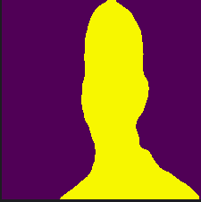
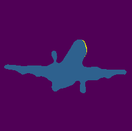
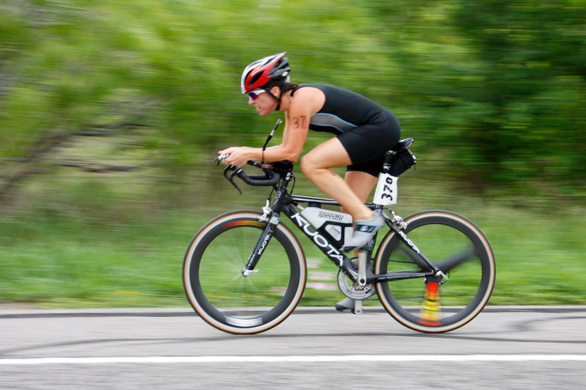
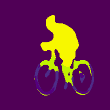
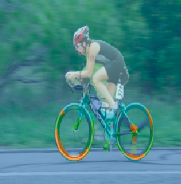
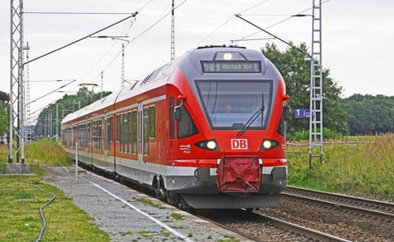
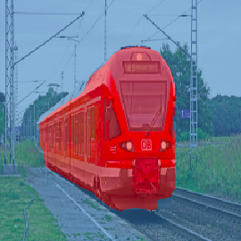

# Semantic segmentation with UNET

| Original Image | Predicted Segmentation Image | Image with segmentation mask|
| ------ |---------| ------------------|
| | | 


This project focuses on implementing semantic segmentation on pascal VOC dataset using UNET. Implementation of UNET is achieved with fastai library. Accuracy achieved is **78.75%** with **output image size 224x224**. GPU used for this project: **NVIDIA GeForce GTX 1050**

## DATASET
--------
Pascal VOC 2012 challenge [dataset](http://host.robots.ox.ac.uk/pascal/VOC/) is popular for object detection and segmentation task. This dataset consists of images which belong to 20 different types of objects. Therefore, 21 classes for predictions including background(class index=0):
```
Person: person
Animal: bird, cat, cow, dog, horse, sheep
Vehicle: aeroplane, bicycle, boat, bus, car, motorbike, train
Indoor: bottle, chair, dining table, potted plant, sofa, tv/monitor
```

Class indices for semantic segmentation task:
```
0=background, 1=aeroplane, 2=bicycle, 3=bird, 4=boat, 5=bottle, 6=bus, 7=car , 8=cat, 9=chair, 10=cow, 11=diningtable, 12=dog, 13=horse, 14=motorbike, 15=person, 16=potted plant, 17=sheep, 18=sofa, 19=train, 20=tv/monitor
```
more example on semnatic segmentation on pascal voc dataset = http://host.robots.ox.ac.uk/pascal/VOC/voc2012/segexamples/index.html


### Downloading dataset:
Download the development kit for training/validation data. More information
```
http://host.robots.ox.ac.uk/pascal/VOC/voc2012/#data
```

Alternative resource of downloading the dataset is using:
```
https://s3.amazonaws.com/fast-ai-imagelocal/pascal-voc.tgz
```

### Directory structure:
After downloading the development kit following will be it's folder structure:
```
VOCdevkit/VOC2012
VOCdevkit/VOC2012/Annotations
VOCdevkit/VOC2012/ImageSets
VOCdevkit/VOC2012/JPEGImages
VOCdevkit/VOC2012/SegmentationClass
VOCdevkit/VOC2012/SegmentationObject
```

### Libraries
```
fastai
numpy
jupyter notebook
```

### Outputs:
input and out images

| Input Images | Predicted Segmentation mask| Image with segmentation mask|
| -----------| ----------------| ----------|
|  | | |
|  | | |
|  | | 